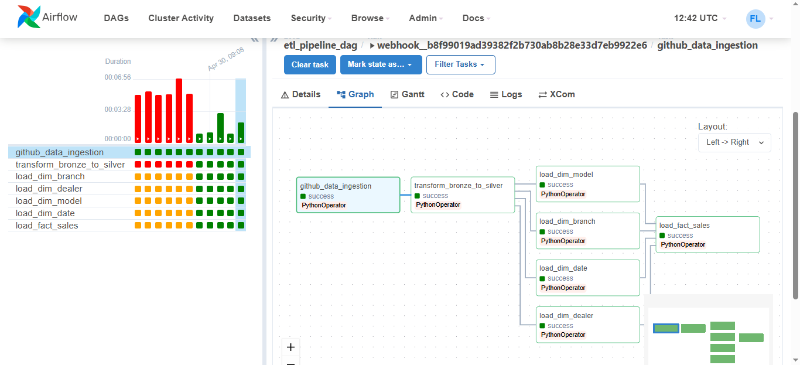

# 📦 DataEngineeringProject: GitHub-Triggered ETL Pipeline with Airflow

An automated ETL (Extract, Transform, Load) pipeline built with **Apache Airflow**, **Docker**, and **MySQL/PostgreSQL**, designed to be triggered by GitHub push events. This project showcases a modern data engineering architecture with support for Bronze → Silver → Gold data layering and GitHub Webhooks for CI-style automation.

---

## 📌 Table of Contents

- [📖 About the Project](#-about-the-project)
- [🧰 Technologies Used](#-technologies-used)
- [⚙️ Prerequisites](#️-prerequisites)
- [📦 Installation & Setup](#-installation--setup)
- [📂 Project Structure](#-project-structure)
- [🗃️ Dataset](#️-dataset)
- [📌 Airflow DAG](#-airflow-dag)
- [🔐 Webhook Integration](#-webhook-integration)
- [📄 License](#-license)

---

## 📖 About the Project
This project demonstrates a **GitHub-integrated, end-to-end Data Engineering pipeline using Apache Airflow**. It automates the extraction of CSV data from a GitHub repository, loads it into a MySQL database ("Bronze" layer), performs transformations into structured "Silver" tables, and aggregates them into analytical "Gold" fact and dimension tables for further analysis. The pipeline is automatically triggered whenever a new commit or push is made to the GitHub repository.


### Key Features:
- Trigger DAGs on GitHub Push Events via Webhook
- Multi-layered ETL architecture
- Dockerized Airflow environment
- Modular codebase for extract, transform, and utility logic
- Real-world GitHub data as the source

---

## 🧰 Technologies Used

- 🐍 **Python** (ETL scripts and webhook listener)
- 🐳 **Docker & Docker Compose** (Containerized deployment)
- ☁️ **Apache Airflow** (Workflow orchestration)
- 🐬 **MySQL / PostgreSQL** (Relational database storage for Bronze, Silver, Gold layers, and Log file )
- 🛠️ **Flask (for webhook listener)** (Webhook listener server)
- 📡 **GitHub Webhooks** (Event-based triggering mechanism)
---

## ⚙️ Prerequisites

Before you begin, ensure you have the following installed:

- [Docker](https://docs.docker.com/get-docker/)
- [Docker Compose](https://docs.docker.com/compose/)
- [Git](https://git-scm.com/)
- [Ngrok](https://ngrok.com/download) – for webhook testing
- [Python 3.8+](https://www.python.org/downloads/)

---

## 📦 Installation & Setup

### 🔁 1. Clone the Repository
```bash
git clone https://github.com/its-sagar/End_To_End_Data_Engineering_Project.git
cd End_To_End_Data_Engineering_Project
```

### 🐳 2. Launch Docker Containers
```bash
docker-compose up --build
```

This starts:
- Apache Airflow (Webserver: `localhost:8080`)
- MySQL / PostgreSQL for data storage

### 🛰️ 3. Create and Activate Python Virtual Environment (optional)
```bash
python -m venv venv
source venv/bin/activate  # on Linux/Mac
venv\Scripts\activate     # on Windows
```

### 🔧 4. Install Required Python Packages
```bash
pip install -r requirements.txt
```

### 5. Create and Setup `config.py` file

```
MYSQL_HOST=localhost
MYSQL_USER=root
MYSQL_PASSWORD=yourpassword
MYSQL_DB=bronze_layer
```
Note - See the **config.py.example** for reference.

### 🌐 6. Start Webhook Listener (Flask App)
```bash
python webhook_listener.py
```

### 🌍 7. Use Ngrok to Expose Webhook Listener Publicly
```bash
ngrok http 5000
```

Copy the HTTPS URL shown (e.g., `https://abc123.ngrok.io`) for GitHub webhook setup.

---

## 📂 Project Structure

```
.
├── config/               # Configurations
├── dags/                 # Airflow DAGs
├── extract/              # Data extraction logic
├── transform/            # Transformation logic (bronze → silver → gold)
├── utils/                # DB connection utils
├── plugins/              # Optional Airflow plugins
├── logs/                 # Airflow logs
├── venv/                 # Virtual environment
├── webhook_listener.py  # Flask app to receive GitHub webhook
├── docker-compose.yaml  # Docker setup
├── requirements.txt      # Python dependencies
└── .env                  # Environment variables
```

---

## 📊 Dataset Overview

- **Format**: CSV
- **Uploaded**: into the GitHub repo(Manually)
- **Ingestion Target**: Bronze Layer (MySQL)
- [Download Dataset](Dataset/SalesData.csv)
---

## 🏗️ Pipeline Overview

### 1. **Ingestion Layer (Bronze)**
- Raw CSV files ingested into raw tables.
- Supports incremental load (avoids reloading duplicate entries).

### 2. **Transformation Layer (Silver)**
- Cleans and standardizes data.
- Converts raw tables into domain-specific structured tables.

### 3. **Analytics Layer (Gold)**
- Creates **Fact** and **Dimension** tables from Silver layer.
- Supports star-schema model.
- Used for reporting and BI tools.

---

## ✨ Features

- GitHub-triggered automation using Flask + Webhooks
- Incremental data loading to avoid duplicate ingestion
- Multi-layered ETL (Bronze → Silver → Gold)
- Dockerized Airflow and MySQL environment
- Easily extendable to S3, PostgreSQL, or cloud data warehouses

---

## 📌 Airflow DAG

Your main DAG file is located at:
```
dags/etl_pipeline_dag.py
```
The DAG coordinates:
- GitHub extraction
- Bronze → Silver → Gold transformation
- Data loading

Airflow UI: http://localhost:8080  
Login: `airflow / airflow` (default)

---

## 🔐 Webhook Integration

To trigger Airflow when new commits are pushed:

1. Go to your GitHub repo → **Settings** → **Webhooks**
2. Click **Add Webhook**
3. Set:
   - **Payload URL**: `https://<your-ngrok-url>/webhook`
   - **Content Type**: `application/json`
   - **Secret**: *Optional but recommended (sync with `GITHUB_SECRET` in `.env`)*
   - **Events**: Trigger on `push`
4. Save webhook

---

## 📄 License

This project is licensed under the MIT License - see the [LICENSE](LICENSE) file for details.

---

## 🙌 Acknowledgments

- [Apache Airflow Documentation](https://airflow.apache.org/docs/)
- [GitHub REST API](https://docs.github.com/en/rest)
- [Docker Compose Docs](https://docs.docker.com/compose/)
